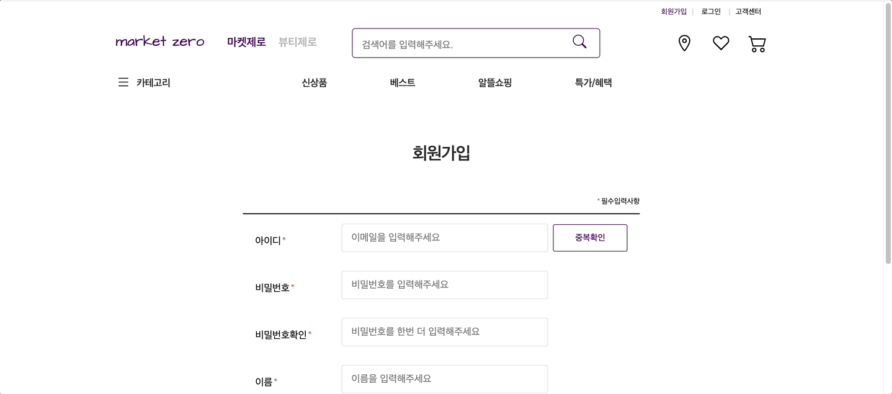

# market zero
- notion : https://www.notion.so/2-4-381d1ce6b802488caa07380607163e36
- vercel : https://marketzero-frontend.vercel.app/
  
 

## 🙋🏻‍♀️ 프로젝트 소개

- 소비자에게 건강하고 신뢰를 줄 수 있는 다양한 상품 추천 및 서비스를 제공하는 커머스 입니다.

   

## 👩🏻‍💻 개발 기간

- 2023.07.03 ~ 2023.07.30

 

## 💡 기술 스택

- 프론트엔드
   
  
   
  
   
  
   
  
   
  
   
  

 

- 백엔드
   
  

 

- 협업
   
  
   
  

 

## ➰ 프로젝트 페이지 구성 및 기능

1. `메인 페이지`
   
    

   - Carousel (배너, 추천 상품)
   - 하루 특가 타임 기능
   - 카테고리 2depth 구현
   - 카테고리 페이지 이동
  
 

2. `회원가입` , `로그인`
   
    

   - 중복확인 기능
   - 유효성 검사
   - 소셜 로그인 (구글 로그인)
   - 로그인 시에는 메인페이지 OO님, 로그아웃 추가

 

3. `카테고리 페이지`
   
    

   - 추천순 / 낮은 가격순 / 높은 가격순 필터링
   - 페이지네이션
     
 

4. `디테일 페이지`
   
    
   - 검색창 키워드 입력 시 상품명 자동 완성
   - 상품 상세 페이지
   - 위시리스트 클릭 시 모달 및 이동
   - 장바구니 담기 클릭 시 모달 및 이동

 

## Reference

- 이 프로젝트는 [마켓컬리] 사이트를 참고하여 학습 목적으로 제작되었습니다.
